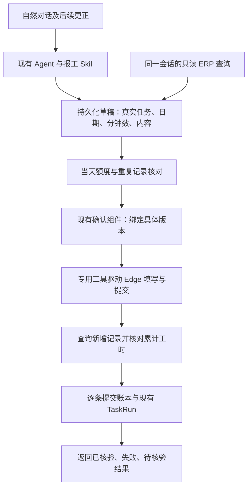

# ERP 对话报工实施计划

日期：2026-09-20。状态：**实施中。M0–M3 的代码与模拟验证已完成首轮，M4/M5 已实现自由对话 Skill、算术验证码自动登录、结果未知回查、中断批次收口及剩余条目重新确认接续；真实 ERP 登录与提交仍未验收。**

需求依据：[ERP 对话报工约定](./ERP-WORK-REPORT.md)。完成标准：[开发契约](./DEVELOPMENT-CONTRACT.md)。本计划采用用户已确认的自由表达、允许小数工时、本人当天合计最多 8 小时、确认后通过浏览器报工的要求。

## 实施进度（2026-09-21）

- M0：已锁定生产依赖 `playwright-core@1.63.0`，完成 Vite external、electron-builder files/asar 配置；本机 Edge 153 的可见浏览器模拟探针已验证独立 profile、登录、任务行、双弹窗、0.5 小时填值回读、取消和关闭。当前构建的隔离打包程序已通过本地模拟表单探针，验证包内 Playwright 加载、取消零写入与确认一次写入。
- M1：已新增运行时契约、口语时长换算、8 小时/精度校验、草稿/批次/逐条 attempt 账本及双 adapter 测试；`connect_erp`、`read_erp_context`、`prepare_erp_report` 已接入现有 Agent。
- M2：已新增 ERP 设置页、受信 IPC、独立浏览器连接服务、严格密码加密路径、身份/任务/本人指定日期完整分页读取。账号密码可代填；看图能力开启时会尝试算术验证码登录，失败保留可见窗口人工接管。真实账号联调尚未执行。
- M3：已新增 `erp-work-report` 业务预览、`0033_strict_approval_binding.sql`、严格审批凭据、网页确定动作、逐条写入账本与保存后唯一记录回查。审批/步骤/账本失败、预览过期、8 小时超限均在发送前停止；真实 ERP 写入仍未验收。
- M4/M5：自由对话 Skill、同草稿修订、受限算术验证码解析、三次识别上限、`reconcile_erp_report` 结果未知回查、部分批次剩余条目重新确认接续、运行历史报工明细及用户使用/恢复说明已实现首轮。验证码 20 样本、真实重启/部分完成体验，以及打包应用内审批→账本→网页→回查的完整模拟仍待收口。
- 2026-09-22 恢复边界补强：浏览器调用抛错后将可能已发送的条目标为 `unknown` 并释放本地活动认领；启动时将遗留 `dispatching`/`verifying` 标为待核验、未发送的 `prepared` 标为取消，保留已核验条目。同账号同日期只要有未解决发送，新的批次不得领取；同一批次/运行也不能重复领取。回查使用获批时冻结的条目和身份，即使当前草稿后来修订也不会错配旧批次。
- 2026-09-22 接续首轮：`submit_erp_report(batch_id)` 只预览尚未核验的条目，重新读取当日完整记录、任务和原已核验条目；新审批与当前 run/step/call/参数/预览严格绑定后才领取原批次，已产生 attempt 的接续审批不可复用。仍有未知发送、旧记录变化、额度超限或预览变化时停止，原条目不会再次新增。任一批次正在操作专用 ERP 浏览器时，其他日期也不能同时提交。
- 2026-09-22 运行历史：现有详情页从冻结批次及逐条 attempt 账本只读展示日期、账号、任务、工时、内容、当前核验状态和本次运行是否尝试发送；同批次跨运行接续后可回看各次运行参与了哪些条目。
- 2026-09-22 打包态浏览器探针：使用新生成的隔离 `win-unpacked`，校验包内主进程文件与当前构建 SHA-256 一致，并以打包程序的 Node 运行模式从 `app.asar` 加载 Playwright，驱动本机 `127.0.0.1` 模拟 ERP；取消收到 0 次 POST，确认收到 1 次且字段正确。同包 `better-sqlite3`、WAL 与 trigram FTS 通过。此探针运行生产浏览器/表单适配代码，不启动完整应用的审批和账本流程，也不连接真实 ERP。
- 2026-09-22 提交后异常修复：网页返回新增成功后若关闭外层记录弹窗失败，连接服务将结果标为待核验，不能误报“确定未写入”；新增回归测试覆盖此原失败路径及点击前失败路径。
- 2026-09-22 当前自动化：ERP 专项 54 项、启动恢复 4 项、P0 158 项、S2 177 项、S3 168 项通过；全量 Vitest 226 个文件、1356 项通过，类型检查和生产 Vite 构建通过。Electron 设置页、确认预览、剩余条目接续预览及运行历史报工明细已在实际窗口验证；默认/紫色主题及 360×520 最小窗口无横向溢出。Electron runtime 和 100 次窗口生命周期 smoke 通过。修复后新包的浏览器表单模拟及原生 SQLite smoke 通过；真实 ERP、20 张验证码样本与打包应用内完整模拟仍待验收。

## 1. 推荐方案

采用 **现有聊天 Agent + ERP 领域工具 + Playwright 控制独立 Edge 窗口**。用户说自然语言，Agent 整理草稿；程序负责匹配真实任务、小时校验、确认版本、执行和回查。

- 应用内继续使用现有聊天、设置、`ask_user`、`PermissionDialog` 和运行记录。
- 主进程使用新增依赖 `playwright-core`，通过 `msedge` 渠道启动专用可见浏览器；Chrome 为用户明确选择的备选。凭据和会话不经过聊天模型。
- **新增报工始终通过实际网页填写、点击“确定”完成。** 任务检索、当天工时核对和保存后核验使用同一会话下受限的只读 API，以便按真实 ID、用户及完整分页查验。
- 先实现人工登录后的可靠填报，再完成自动账号密码填写和验证码识别。人工登录是阶段性验证方式及最终故障接管方式，不代替最终自动登录目标。
- 首版面向此 ERP、当前用户和一个启用的账号；范围限于新增报工。已有条目的修改、删除及定时提交不纳入本轮。

选型理由：Playwright 已提供元素定位、动态页面等待、表单操作和浏览器生命周期支持，适合当前 Vue/Element Plus 页面。现有 Electron `WindowManager` 的窗口带受信 preload，导航只允许本地 renderer；不能把 ERP URL 加入这个受信列表。外部浏览器保持远程页面与应用权限隔离，不创建第二套应用 UI。

`WebContentsView + debugger` 留作以后确有内嵌浏览器需求时的选项；它需要另行实现远程视图布局、session、导航和等待机制。首版不采用通用浏览器 MCP：现有适配缺少报工业务预览，通用点击也不能表达本次提交的任务、小时及副作用。

官方依据：[Playwright 自动等待](https://playwright.dev/docs/actionability)、[浏览器渠道](https://playwright.dev/docs/browsers#google-chrome--microsoft-edge)、[持久化上下文](https://playwright.dev/docs/api/class-browsertype#browser-type-launch-persistent-context)、[Electron 远程内容安全](https://www.electronjs.org/docs/latest/tutorial/security)。这些资料支持基础能力；本网站兼容性仍以模拟测试及真实验收为准。

## 2. 先补齐的现有能力边界

本节为当前工作树代码检查结果，不把“已有框架”当作“ERP 已经可用”。

1. `src/agent/permissions.ts` 已有强制高风险确认，但 `confirmPermission` 在审批创建或结论保存失败后仍可继续返回批准；ERP 提交需要强制持久化的确认凭据，失败时停止发起提交。
2. `src/tools/types.ts` 的 `ToolContext` 有 `previewRevision`，没有可验证的审批 ID/调用绑定。不能靠模型传入 `approved: true`、自然语言“已确认”或最近一条批准记录放行。
3. `src/agent/loop.ts` 的重复调用缓存主要作用于单次运行。当前工作树已增加 `outcome_unknown` 处理，但跨运行、崩溃与部分成功仍需要 ERP 逐条账本，不能复用成功缓存假装实现跨运行防重。
   `src/agent/run-record.ts` 的运行记录写入也可能降级继续；提交边界必须验证当前 run/step 已可靠记录，不能只检查审批与业务表。
4. `src/security/secret-storage.ts` 的 `protectSecret` 在加密不可用时会返回原文。ERP 新凭据要求明确选择严格保护路径，加密失败不持久化明文；不借此改写所有历史配置行为。
5. `src/skills/resolve.ts` 的自动 Skill 基于当前消息关键词，`src/tools/agent-registry.ts` 还会按激活 Skill 过滤工具。后续“改成四小时”需要根据本对话未完成草稿续接，不能要求用户每轮重复“报工”。
6. `ToolPreviewInfo` 当前只有文件差异、单元格变化、查询计划。报工需要在现有组件新增有类型的业务预览，展示账号、日期、任务、小时和内容，不能直接展示内部参数 JSON。

工作树中 Agent、运行恢复和 UI 已有其他未提交改动。实现前重新检查差异，只扩展必要位置；测试须基于届时实际版本，避免覆盖并行工作。

## 3. 模块与接入位置

以下新增路径是拟定名称，实施时可沿就近命名调整；既有接入位置已检查。

### 3.1 对话与领域层

- 新增 `src/erp/contracts.ts`、`draft-service.ts`、`validation.ts`：结构化数据的运行时校验、草稿版本、增删改、分钟换算及限额规则。
- 新增 `src/erp/task-matching.ts`、`read-client.ts`：任务候选、当前用户、按日全量工时读取。检索先用名称/项目等原文线索，最终绑定 ERP 的 `taskId`，歧义通过现有 `ask_user` 解决。
- 新增 `src/erp/submission-service.ts`、`recovery.ts`：确认快照、串行提交、逐条核验、结果不明后的恢复。浏览器能力以接口注入，领域测试使用 fake adapter。
- 新增 `src/tools/erp/`，在 `src/tools/builtin.ts` 注册；同步插件开关、工具标签和契约测试。默认关闭，通过设置启用。
- 新增项目内 `skills/erp-work-report/SKILL.md`，沿现有 Skill 元数据、工具白名单和测试约定编写，不在模型提示中硬编码账号、任务清单或站点凭据。

### 3.2 浏览器与配置

- 新增 `electron/erp/browser-runtime.ts` 与 `taskboard-adapter.ts`，生产环境由 `electron/main.ts` 注入；管理启动、页面定位、登录、接管和关闭。
- 新增 `src/config/erp.ts`、`electron/ipc/erp.ts`，扩展共享类型和现有 preload；特权 IPC 只通过 `trustedIpcMain`，对 URL、枚举、长度、数值和批次标识检查 `unknown` 输入。
- 浏览器私有 profile 位于应用受控数据目录，不放在项目、Agent 工作区或 ERP 源码目录。按站点、账号配置及浏览器隔离；同 profile 只允许一个活动控制器。
- ERP 设置页复用 `SettingsPageShell` 等现有组件，接入 `SettingsDrawer.tsx`/`SettingsSidebar.tsx`。包含开关、站点、浏览器、账号、凭据保存状态、登录状态、连接/接管/断开操作。
- 提交状态与历史结果接入现有 `RunHistoryPage.tsx`，不新建另一套任务中心。

### 3.3 拟定工具边界

每个工具均显式声明现有五项副作用契约，并在执行入口再次检查 ERP 开关、身份与权限。

- `connect_erp`：启动或恢复登录会话，`risk=medium`、`idempotent=false`、`supportsPreview=false`、`reversible=manual`、`evidence=output`；需要网络及 automation 权限。服务层复用有效会话，失败不无限重复登录。
- `read_erp_context`：仅在已有可用会话下读取任务和本人指定日期工时，`risk=read`、`idempotent=true`、`supportsPreview=false`、`reversible=none`、`evidence=output`。未登录返回需要连接，不在只读工具里暗中启动浏览器或登录。
- `prepare_erp_report`：新增/修订本地草稿，`risk=low`、`idempotent=true`、`supportsPreview=false`、`reversible=manual`、`evidence=output`。以操作标识与基础版本保证重复调用不重复追加；人工业务含义的相似记录不能仅按内容哈希去重。
- `submit_erp_report`：接受明确草稿及版本，或明确已有批次的剩余未发送条目，`risk=high`、`idempotent=false`、`supportsPreview=true`、`reversible=manual`、`evidence=output`，需要网络及 automation 权限，并要求严格持久化审批。预览路径不写草稿、批次或 ERP 数据；批准后再建立不可变批次或领取原批次的剩余工作。
- `reconcile_erp_report`：只读 ERP 并更新本地核验状态，`risk=low`、`idempotent=true`、`supportsPreview=false`、`reversible=manual`、`evidence=output`。因为会更新本地账本，不能标为无副作用 read；任何结果均不触发新增报工。

这里的 `manual` 不代表工具会自动撤销 ERP 记录；确需纠正时由用户核对后走明确的人工流程。模型不获得任意 URL 请求、脚本执行、通用点击或任意用户 ID 写入工具。

## 4. 自由对话如何形成可靠草稿

### 4.1 提取与更正

沿用当前对话模型进行语义整理和工具参数生成，不另起一个独立 Agent 循环。程序保存每条候选对应的用户消息 ID/原话片段、日期、任务线索、工时依据及待确认项。消息引用须属于当前会话的真实用户消息，网页文本不能充当用户授权。

内部使用稳定 `draftId/itemId/revision`，而不是数组下标或消息条数识别记录。修订采用基础版本检查；同一工具调用重复执行可返回原结果，过期版本必须重新读取。

首版每批一个明确日期、最多 16 条（按最少 0.5 小时和每天 8 小时推得）；单条内容长度、原话引用长度、JSON 总字节和候选任务数量均在契约中设上限，并检查 ERP 字段容量，超限给可修改原因，不静默截断。一个对话描述多天时可整理多个按日草稿，各自独立核验及批准。

- “三个半小时”转换成 210 分钟；“大约两小时”保留估计标记，提交前确认；“一上午”补问实际时长。
- 多任务共用一个总时长时询问分配，不平均分摊、不复制总时长；时间段有重叠或休息不明时补问。
- “APS 改成四小时”修订原条目；“采购先不报”移出待提交集合；同任务指代不清时只补问对应项。
- 对话未结束的草稿需通过现有上下文构建/Skill 路由接续；附带少量当前草稿状态，不把历史账本全部塞进模型。
- 同一账号和日期的新对话若发现待提交、部分提交或待核验批次，先提示续接或核对，不能默默创建一批相同报工。
- 普通工作闲聊不自动提交；“整理一下”止于草稿；明确报工意图也必须经过具体业务预览的最终确认。

### 4.2 确认体验

平时在现有聊天里展示简洁草稿，用户可继续口头修改。准备提交时，在现有 `PermissionDialog` 增加 `erp-work-report` 类型的预览，按条显示完整工作内容、日期、项目/任务、工时，以及当天已报、本批和提交后合计。

批准仅需在这个最终预览里确认一次，不再为每个网页点击重复确认。“返回修改”退出当前确认、保留草稿，再继续聊天。为避免把普通“确认”错误解释为高权限授权，首版沿用现有可信确认事件；自由文本本身不直接设置审批通过。

审批弹窗待处理期间草稿不能被后台悄悄修改。新修订必须使旧预览失效；提交后的更正提示已有记录状态，不自动修改或追加抵消条目。所有新 UI 使用 `keeper-*`、`no-drag`，验证键盘焦点、长文本、最小窗口及两种主题。

## 5. 登录、验证码和浏览器执行

### 5.1 运行时

使用 `launchPersistentContext` 的独立目录与 `channel: 'msedge'`，默认可见，开启 Chromium sandbox。拒绝接管用户日常浏览器 profile。锁定并测试 `playwright-core` 版本；不在应用启动时下载浏览器。

首次启用检查 Edge/明确选择的 Chrome 是否可启动，处理缺失、企业策略、profile 占用及版本变化；不通过关闭安全机制自动“修复”。只有用户触发 ERP 功能才启动浏览器。

浏览器控制还需单独的 profile/页面动作锁，覆盖所有日期和聊天，避免两个批次同时改同一张表单；不能仅靠按账号/日期的额度锁。自动操作按固定顺序取得 profile 锁和日期 claim，人工接管期间禁止其他自动动作；等待审批前不预先占住可变网页表单。

将停止接收动作、取消、限时关闭浏览器和账本收口纳入 `src/runtime/shutdown-coordinator.ts`，在数据库关闭前完成；接入现有电源/睡眠生命周期。人工关闭浏览器、进程崩溃、睡眠恢复后先核验状态，不能自动接着点击确定。

### 5.2 凭据与验证码

账号凭据由受信设置界面接收，密码通过现有受控配置层的严格加密路径保存；renderer 读取设置时只得到已配置/掩码状态，不返回已保存密码。新凭据加密不可用时不落盘，可以改为人工登录。浏览器进程只继承启动所需环境变量，不继承模型密钥。

复用现有视觉配置及 `src/vision/bailian-vl.ts` 客户端，遵守图片发送开关。验证码采用独立的临时识别路径：只取验证码图的内存字节，不直接调用会产生 sidecar 缓存的 `look_at_image`，不保存验证码答案、密码字段截图、网络 HAR 或包含凭据的 trace。

识别只输出受限算式，由程序按允许的数字/运算符语法计算；拒绝任意代码、无法解释的字符及无效算式。图片刷新即丢弃旧答案，提交前确认仍是同一验证码。建议每次登录最多尝试 3 张验证码（含首次）；密码错误立即停止，其他错误分类处理。最终答案必须由实际登录成功验证。

人工接管时暂停所有自动填写并显示浏览器；通过现有等待用户/恢复路径继续，不在普通工具调用里无限等待。继续后重新检查账号、页面和草稿。恢复登录后如身份或日期变化，旧批准失效。

### 5.3 只读核验与网页写入

读取适配包括当前用户 `/getInfo`、任务 `/business/task/board` 或分页列表、报工 `/business/time-entry/list` 和详情，以及任务详情。API 前缀通过配置及实际页面请求核对，不能假设部署固定为某个前缀。

此 ERP 将 token 存在 `GTerp-Token` cookie，但 Axios 实际发送 `Authorization: Bearer …`。Playwright 请求上下文共享 cookie，不会自动执行网页的 Axios 拦截器。受限只读客户端必须在主进程内为正确站点及 API 前缀附带必要认证头，不允许模型提供认证头；拒绝携带认证跨源跳转。原始 token 不作为工具输出。

当天明细显式指定本人 `ownerId` 和同一天的日期范围，处理全部分页、重复 ID、返回总数变化和无效字段；读取无法证明完整时停止。缓存只可用于检索体验，审批及写入前须重新查询。同一任务历史 `actualHours` 不能用于本人当日限额。

写入按 `data-task-block=taskId` 定位任务行，再限定“实际工时”和目标弹窗中的控件。填入后读取控件实际值与草稿逐字段比对，防止日期格式、数值精度、错行或人工改动造成偏差。点击确定前监听并约束本次报工请求的目标、方法和业务载荷，仅放行符合已批准条目的新增。

受控会话的报工写入默认关闭，只在相应条目 `dispatching` 已落盘且批准有效时发放一次性请求许可；双击、重复 POST、其他任务/用户载荷及无许可的修改/删除不得放行。人工登录接管不解除报工写入门禁。登录及业务读取分别走已声明的路径，不把这项门禁扩展成任意网络工具。

保存后检查业务响应并回查新增记录，关闭外层工时弹窗，再核对任务累计值。仅 HTTP 200、弹窗关闭或提示“报工成功”均不足以单独证明提交已核验。

## 6. 持久化、确认绑定与防重复

### 6.1 最小业务数据

继续使用现有数据库与 Repository，不把账本放在聊天文字、临时日志或浏览器 localStorage。拟定三个领域表，最终字段在迁移实现前固定：

- `erp_report_drafts`：草稿 ID、所属会话、站点/账号、日期、revision、状态、有界条目 JSON、用户消息引用和更新时间。允许尚未匹配的草稿，提交时必须全部解析完成。
- `erp_report_batches`：批准后冻结的草稿版本、条目快照、账号/日期、基线摘要、`approval_id`、run 关联和聚合状态。约束同一草稿版本只能形成一个批次。
- `erp_report_submissions`：每条逻辑报工的每次尝试一行，保存稳定操作 ID、attempt 序号/前次尝试 ID、批次条目、业务指纹、准备/发送/核验状态、发送前已知记录 ID、匹配到的远程记录 ID、审批/run/step/call 关联及去敏错误。重试沿用操作 ID，旧尝试保留；事件关联现有 `task_run_steps`，不另外创建 TaskRun 系统。同一操作只允许一个尚可能产生记录或已核验的尝试，明确证明前次未写入后才允许新尝试。

小时内部以整数分钟表示，结合 ERP 一位小数精度校验；每天上限为 480 分钟。日期采用明确的 `YYYY-MM-DD`，以该 ERP 的 Asia/Shanghai 业务日期核对。“今天”在预览中展开，跨日不自动替换。

新 migration 使用实施时下一个未占用序号，更新 migration 账本、schema、Repository 和 `docs/DATABASE.md`，覆盖 native/sql.js 两种临时库。历史核验账本不能随聊天清理或短期 checkpoint 过期而丢失；会话/run 引用清理时保留防重所需的最小业务证据，并按现有删除规范处理关联。

### 6.2 持久化批准

复用现有 `approvals`，通过有类型的确认结果携带 `approvalId`、调用 ID、完整规范化参数摘要和预览版本。可为 ERP 提交工具声明可选的严格持久化审批要求，现有普通工具默认兼容。

现有 boolean 确认调用可保留兼容包装；Agent 主循环取得可验证的审批凭据后放入 `ToolContext`，不能让模型填写。新增字段及 Repository 查询沿现有审批表扩展，不新造另一张审批表，也不用截断的 `args_summary` 作为签名。

在建立批次的短事务里核验：用户批准、对应工具/run/session/call、同一草稿版本、同一账号/站点/日期、规范化参数摘要和预览摘要均一致；当前 run/step 必须已记录。审批创建、结论存储、读回、run/step 或批次领取失败时，不发送 ERP 新增请求。数据库事务不得跨浏览器/网络等待。

恢复时的只读核验不需要重新批准；重启、取消或部分失败后要继续发出未发送条目，必须为“原批次剩余条目＋最新基线”取得当前 run 的新批准。新批准绑定原批次/稳定操作 ID，不复制已成功条目或修改原获批内容。迟到的旧尝试回调须按 attempt 与状态做条件更新，不能覆盖新状态。

### 6.3 每条提交顺序

1. 对同一站点、账号和日期串行化，跨聊天共用锁；在数据库里以唯一 active claim 原子领取批次，不能仅用内存 Map 防重。未知结果未解决时，不能因重启或租期到期自动释放额度给其他批次。
2. 回读身份、任务、当日完整记录和未解决提交；验证快照与 480 分钟限额。未知提交尚未解决时，不继续占用同一日额度。
3. 已核验操作直接返回原结果；待核验操作进入回查；仅明确未发出的批准条目可以继续填写。
4. 网页值与批准条目核对后，**先持久化 `dispatching`，再允许点击确定发出请求**。没有持久化成功就不能点击。
5. 响应正常时进入 `verifying`，通过新记录 ID、账号、任务、日期、工时、内容及发送前 ID 集合核验。唯一匹配且累计读回一致后标为 `verified`。
6. 点击后超时、断网、用户取消或进程退出时，可能已提交的条目标为 `unknown`/待核验；停止后续新增。取消不能假装撤销已经发生的 ERP 操作。
7. 后续恢复首先回查：存在唯一可信新记录则补记核验；存在多个候选、结果仍不可见或证据不完整时保留待核验。一次没查到不等于确定未提交，不自动再次新增。

每条发送前回读日累计，计算“远端当前已报＋本批尚未发送”，已核验条目已在远端合计中，不可再次相加。预览基线的正常推进只允许加入本批刚核验的记录；其他并发新增、删除或变更使原预览失效，须重新核对。远端记录 ID 一旦确定，后续界面刷新、累计值核验或本地最终记账失败都不能触发再次新增，应返回“已保存，核验未完整”并继续回查。

批次聚合区分全部核验成功、部分成功、未开始/取消、失败和待核验。已成功条目保留，不能自动删除来“回滚整批”。普通新消息重复提交也须跨批次查重；内容指纹用于提示相似记录，不能作全局唯一键，否则会阻止合理的第二次报工。

服务端没有业务幂等键和原子的每日 8 小时限制。因此本方案提供保守的“记录不明先停下核对”，不能承诺所有并发场景下的全局恰好一次。若以后要求跨多个客户端强制保证，需要另立 ERP 后端改动：事务内每日额度校验、幂等键唯一约束、返回新记录 ID；不纳入当前只改守岸人的首版范围。

## 7. 分阶段落地与验收门槛

各阶段按以下顺序推进。核心规则/假服务测试可以和浏览器可行性验证并行；正式提交路径在持久化审批、账本及只读核验完成前不开启。阶段时长是单人有效开发时间的粗估，包含对应测试，完成第一阶段后重估。

### M0：浏览器和打包可行性验证（0.5–1 天）

交付：最小 ERP 模拟登录/双弹窗页面、可注入浏览器接口、Edge 独立 profile 探针；将 `playwright-core` 作为锁定的生产依赖，处理 Vite external、electron-builder files 与必要 asar 资源。

验收：开发态和打包可执行程序都能打开模拟页、填写、取消、人工接管并关闭；profile 不与日常浏览器共享；浏览器缺失、被策略阻止、关闭时有明确结果。先不访问生产账号、不新增真实报工。**此关未过，不扩大 UI 或提交实现。**

### M1：草稿、规则和持久化底座（1.5–2.5 天）

交付：ERP 领域类型、分钟/日期校验、草稿及提交表、Repository、迁移、假 ERP client；准备/修订草稿工具及基础运行关联。

验收：自然语言模型产生的结构化候选经运行时校验；同一草稿多次修订和消息重复不重复追加；7.5+0.5 通过、7.5+1 拒绝，跨任务合计正确；迁移在双适配器临时库通过，草稿重启可读。此阶段不宣称浏览器闭环已完成。

### M2：本地配置、人工登录和只读适配（1.5–2 天）

交付：ERP 设置入口、严格凭据保护、浏览器连接/接管、身份绑定、任务匹配与按日完整分页查询；源代码定位器和只读接口 adapter。

验收：模拟 ERP 的身份变化、401、分页异常、任务重名、空任务、错误数据均有明确状态；用户人工登录后可读取本人任务和本人当天工时，不混入其他用户或历史日期。真实只读验收需届时本地账号可用。

### M3：一次确认、网页提交和逐条核验（2–3 天）

交付：严格审批凭据、`erp-work-report` 预览、不可变批次、提交账本、网页填报及回查、部分结果呈现；写入入口仅开放给独立高风险工具。

验收：拒绝或审批/账本写失败时 **零新增请求**；预览过期不能提交；在模拟 ERP 中完成多任务提交、关闭外层弹窗及总工时刷新；模拟“服务端已保存但响应丢失”后重试不重复报工。先让人工登录下的完整业务闭环成立。

### M4：自由对话接续和自动登录（1.5–2.5 天）

交付：报工 Skill、按未完成草稿续接的上下文/工具可见性、口语时长与修改流程、自动填写凭据、临时验证码识别及失败接管。

验收：不依赖固定格式或每轮关键词；“改成四小时”“采购先不报”修改原草稿；模糊时长不捏造；同一确认不会逐条再问。验证码关闭、识别失败、图片刷新、密码错误、登录超时均正确退出或接管。真实识别用至少 20 张不同验证码样本记录首试/补试/接管情况，不预先承诺识别率。

### M5：恢复、打包及真实验收收口（1.5–2.5 天）

交付：重启/睡眠/关闭/超时恢复、已有运行记录中的业务明细、完整验证入口、用户使用说明及限制说明。

验收：故障注入覆盖发送前、发送后、远程已保存、本地核验写失败、部分完成等边界；同一天两个聊天串行化，不同日期批次也不能并发操作同一浏览器；未知条目不被自动重放。Electron 两种主题、最小窗口和开发版 StrictMode 通过；打包态真实可用浏览器完成模拟流程。最后由用户在本地配置账号，用已核对的实际报工或测试任务验收登录、0.5 小时、多条合计和回查结果。

粗估总量约 **9–14 个有效开发日**；等待账号/测试任务、部署版本差异和外部服务不可用不计入其中。这是排期依据，不是已经开始执行的交付承诺。M0/M1 可并行；M3 是人工登录版本的首次完整闭环；M4/M5 完成后才能称首版目标交付。

## 8. 测试与发布要求

- 每批代码：`pnpm typecheck`、相关 Vitest、`git diff --check`。涉及已有缺陷修复须先有原失败路径回归测试。
- 新增拟定入口 `pnpm test:erp`，覆盖领域、工具、凭据、审批、恢复及 fake ERP，使用临时数据与假网络。自然语言案例以用户消息与结构化结果固定样本验证；真实模型质量另做人工评估，不能让 CI 依赖真实模型密钥。
- Agent/权限相关运行 S2/S3/P0 的相关契约测试，覆盖允许、拒绝、失效确认、失败、取消、重复与结果未知。
- 数据库改动验证 native/sql.js、迁移失败、兼容、会话清理保留防重证据、WAL/备份，不接触真实用户数据库。
- UI 改动运行 `pnpm build`、`pnpm test:ui:strict`，在真实 Electron 检查设置、确认、等待接管、部分失败和待核验状态，默认及非蓝色主题、360×520 聊天最小窗口。
- 浏览器运行时和生命周期运行相关 Electron smoke；打包后运行 `pnpm test:erp:packaged` 验证浏览器/表单模拟，再完成打包应用内审批、账本、网页与回查的完整模拟。`playwright-core` 仅主进程 external；打包携带所需资源但不携带 profile、验证码、凭据、HAR 或用户数据。
- 里程碑收口运行 `pnpm test`、`pnpm build` 和 ERP 专项入口；界面及运行时变化同时按开发契约执行相应专项，失败或无法执行须标明，不写成通过。
- 更新 `docs/DATABASE.md`、相关设计/用户使用文档及本计划状态。阶段结论分别标记计划、代码完成、自动化通过、真实验收完成。

## 9. 已知边界与后续需要用户提供的内容

现有信息足以开始 M0/M1 和模拟测试，不需要用户现在在聊天中提供密码。真实只读联调及最终提交验收时，需要用户在本地配置账号，并明确一个可验收的任务/真实报工草稿。

实施时还要验证本地 ERP 源码与部署版本是否一致、受管浏览器能否启动、视觉模型配置是否可用。源码不一致时以实际页面和接口重新适配，不扩大为修改整个 ERP。

当前站点使用 HTTP，本地凭据加密不等于网络传输加密；传输保护需站点 HTTPS 或可信网络环境支持。首版不擅自变更 ERP 部署或协议。

正式提交能力默认关闭到 M3 的审批、限额与故障测试通过；最终是否交付以 M5 的验收证据为准，不能用计划文件或“点击了确定”代替完成证明。
