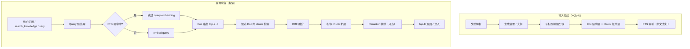

# 知识库检索优化方案

> 版本：0.1.0  
> 更新日期：2026-07-03  
> 状态：**方案设计**（待实施）  
> 关联文档：[DESIGN.md §5.5 RAG 子系统](./DESIGN.md)

---

## 1. 背景与目标

### 1.1 背景

The Shorekeeper 当前采用 **Dense（向量）+ Sparse（FTS5 BM25）+ RRF 融合** 的混合检索方案，默认 `catalog` 注入模式由模型按需调用 `search_knowledge` 工具。该架构在英文或术语明确的场景下表现良好，但在**中文个人知识库**场景存在若干结构性短板，导致准确率与 API 成本未达最优。

### 1.2 优化目标

| 目标 | 说明 | 度量 |
|------|------|------|
| **准确率** | 减少跨文档误召回、中文专有名词漏召回 | 人工抽检 top-5 命中率 |
| **成本** | 降低单次检索的 Embedding API 调用 | 每次 `search_knowledge` 的 API 次数 |
| **延迟** | 检索链路在桌面端保持毫秒~百毫秒级 | P95 检索耗时（不含 LLM） |
| **侵入性** | 分阶段落地，每阶段可独立上线 | 不破坏现有导入/重索引流程 |

### 1.3 非目标

- 引入 Graph RAG、多轮 Agentic 检索循环
- 替换为云端向量数据库（Pinecone / Qdrant 等）
- 支持超大规模知识库（>10 万 chunk）的 ANN 索引（当前规模不需要）

---

## 2. 现状分析

### 2.1 当前检索链路

```
用户 query（或 search_knowledge 工具参数）
  → embedText(query)                    # 1 次 Embedding API
  → dense top-20（余弦相似度，chunk-cache 内存）
  → sparse top-20（document_chunks_fts BM25）
  → RRF 融合（hybrid.ts）
  → ragMinScore 过滤（默认 0.35）
  → 每文档 chunk 上限（默认 2）
  → 格式化返回 / 注入 prompt
```

**相关模块：**

| 文件 | 职责 |
|------|------|
| `src/rag/retriever.ts` | 检索主流程 |
| `src/rag/hybrid.ts` | Reciprocal Rank Fusion |
| `src/rag/documents.ts` | FTS 查询、文档/chunk CRUD |
| `src/rag/chunker.ts` | 分块（512 字符 + 64 overlap） |
| `src/rag/chunk-cache.ts` | 向量内存缓存 |
| `src/rag/text-import.ts` | 导入 + 批量 embed |
| `src/tools/memory/knowledge-tools.ts` | `search_knowledge` 工具 |
| `src/agent/context-builder.ts` | RAG catalog / auto 注入 |
| `src/config/performance.ts` | `ragInjectMode`、`ragMinScore` 等 |

### 2.2 已具备的优势

1. **混合检索框架**：Dense + Sparse + RRF 是业界成熟方案，基础正确。
2. **Catalog 默认模式**：避免每轮对话都走向量 API，成本可控。
3. **工具化检索**：模型按需调用 `search_knowledge`，类似轻量 Agentic RAG。
4. **Markdown 感知分块**：按 `#` 标题切分，优于纯字符切分。
5. **文档级去重**：`ragMaxChunksPerDoc` 防止单文档霸榜。
6. **导入去重**：`content_hash` 跳过重复内容。
7. **查询缓存**：60 秒内相同 query 复用结果。

### 2.3 核心问题

#### 问题 A：中文 Sparse 检索几乎失效（P0）

FT
FTS 表使用 `unicode61` tokenizer，不做中文分词：**

```sql
CREATE VIRTUAL TABLE document_chunks_fts USING fts5(
  chunk_id UNINDEXED, document_id UNINDEXED,
  content, filename, tokenize='unicode61'
);
```

**Query 侧分词按空格/标点切分，对中文无效：**

```typescript
// src/rag/documents.ts
const tokens = trimmed.split(/[\s,，。！？、]+/)...
```

**影响**：RRF 的 sparse 路在中文场景下基本空转，实际退化为「纯向量检索 + 偶尔英文/数字命中」。混合检索的理论优势未发挥。

#### 问题 B：扁平 chunk 检索，跨文档噪声（P1）

所有文档的 chunk 在同一池竞争 top-20。当知识库有 10+ 份文档时：

- 问 A 文档内容，可能召回 B 文档语义相近段落
- 同一主题在多份文档重复出现，RRF 分数分散

#### 问题 C：Catalog 信息不足（P0）

当前 catalog 仅列出文件名，模型不知道每份文档的内容概要，导致：

- 遗漏调用 `search_knowledge`
- 使用过于笼统或偏题的 query
- 首次无结果后放弃或多次重试（隐性 API 成本）

#### 问题 D：Chunk 缺少结构上下文（P1）

512 字符块直接 embed，无 `[文档名 > 章节标题]` 前缀。向量表示的是孤立文本片段，在结构化文档（需求/OA/流程）中容易语义漂移。

#### 问题 E：缺少精排层（P2）

RRF 融合后直接截 top-5。RRF 擅长**召回**而非**精排**，top-5 中常混入「语义相关但事实不准确」的段落。

#### 问题 F：每次检索必调 Embedding API（P2）

即使 query 包含文档中精确出现的专有名词，也会调用 `embedText(query)`，存在可跳过的 API 成本。

---

## 3. 目标架构

### 3.1 分层检索模型



### 3.2 与现状对比

| 维度 | 现状 | 目标 |
|------|------|------|
| Sparse 检索 | unicode61，中文几乎无效 | trigram 或 jieba 分词 |
| 检索范围 | 全库 chunk 扁平竞争 | Doc 路由 → Doc 内 chunk |
| Catalog | 仅文件名 | 文件名 + 一句话摘要 |
| Chunk 表示 | 裸文本 | 带 `[文档 > 章节]` 前缀 |
| 上下文 | 单 chunk | 相邻 chunk 扩展 |
| 精排 | RRF 直接截断 | 可选本地 Cross-Encoder |
| API 成本 | 每次必 embed | FTS 强命中时跳过 |

---

## 4. 优化项详述

### 4.1 P0：修复中文 FTS

**方案 A（推荐，零依赖）：FTS5 trigram tokenizer**

```sql
-- 新建 FTS 表（需迁移 + 重建索引）
CREATE VIRTUAL TABLE document_chunks_fts USING fts5(
  chunk_id UNINDEXED,
  document_id UNINDEXED,
  content,
  filename,
  tokenize='trigram'
);
```

- trigram 支持中文子串匹配：「登录」可命中「用户登录流程」
- 需确认 sql.js 版本支持 trigram（SQLite ≥ 3.40）

**方案 B（效果更好，加依赖）：jieba 分词**

- 导入时将 content 用 jieba 分词后以空格连接写入 FTS
- Query 侧同样分词后构造 MATCH 表达式
- 依赖：`nodejieba` 或 `@node-rs/jieba`

**建议**：优先方案 A；若 trigram 效果不足再上方案 B。

**改动范围：**

| 文件 | 变更 |
|------|------|
| `src/db/migrations/00xx_rag_fts_trigram.sql` | 新建 trigram FTS 表 |
| `src/rag/documents.ts` | 调整 `searchChunksFts` 的 MATCH 逻辑 |
| `src/rag/reindex.ts` | 提供 FTS 重建入口 |

**验收标准：**

- Query「登录流程」能在含该词的 chunk 中 FTS 命中
- sparse 路与 dense 路在 RRF 中均有有效排名

---

### 4.2 P0：文档摘要 + 增强 Catalog

**导入时生成摘要（一次性，无查询成本）：**

| 方式 | 成本 | 质量 |
|------|------|------|
| 规则提取（首段 + `#` 一级标题拼接） | 零 | 中等，足够 catalog 使用 |
| 导入时 1 次 cheap LLM 调用 | 低 | 高 |

**Schema 扩展：**

```sql
ALTER TABLE documents ADD COLUMN summary TEXT;
ALTER TABLE documents ADD COLUMN outline TEXT;  -- JSON: ["1. 概述", "2. 登录", ...]
```

**Catalog 格式升级：**

```
【已导入知识库】
1. 需求规格说明书.md — 产品功能与非功能需求、用户角色与登录模块说明
2. OA流程.md — 请假/报销审批节点与表单字段
```

**改动范围：**

| 文件 | 变更 |
|------|------|
| `src/db/migrations/00xx_rag_summary.sql` | 新增 summary / outline 列 |
| `src/rag/summary.ts`（新建） | 规则/LLM 摘要生成 |
| `src/rag/text-import.ts` | 导入时调用摘要生成 |
| `src/rag/retriever.ts` | `formatDocumentCatalogForPrompt` 含摘要 |
| `src/rag/documents.ts` | DocumentInfo 扩展字段 |

**验收标准：**

- 导入后 documents.summary 非空
- Catalog prompt 包含摘要，模型能更准确选择检索目标

---

### 4.3 P1：文档级路由 → 文档内 Chunk 检索

**思路：**

1. 导入时：为每份文档生成 **文档级 embedding**（summary + filename 拼接后 embed，1 向量/文档）
2. 查询时：
   - 先用 query embedding 匹配 top-2~3 文档
   - 仅在这些文档的 chunk 子集内做 hybrid 检索

**收益：**

- 搜索空间缩小 80%+（10 份文档 vs 200 个 chunk）
- 跨文档误召回显著下降
-  brute-force 余弦更快（候选集更小）

**改动范围：**

| 文件 | 变更 |
|------|------|
| `src/db/migrations/00xx_rag_doc_embedding.sql` | documents 表加 `embedding BLOB` |
| `src/rag/text-import.ts` | 导入时 embed 文档摘要 |
| `src/rag/retriever.ts` | 新增 doc 路由步骤，chunk 检索限定 document_id |
| `src/rag/reindex.ts` | 重索引时同步 doc embedding |

**路由策略：**

```typescript
// 伪代码
const docHits = topKBySimilarity(queryVec, docEmbeddings, 3);
const candidateDocIds = docHits.map(h => h.item.id);

// 仅在 candidateDocIds 的 chunk 中检索
const chunkSubset = allChunks.filter(c => candidateDocIds.includes(c.documentId));
```

**降级**：文档 ≤ 3 份时跳过路由，直接全库检索（避免过度过滤）。

**验收标准：**

- 10+ 文档场景下，问「A 文档的 X 功能」不再召回 B 文档

---

### 4.4 P1：Chunk 上下文前缀

**嵌入与 FTS 索引时使用带前缀的文本：**

```text
[需求规格说明书.md > 3.2 登录流程]

用户登录支持手机号+验证码方式，验证码有效期 5 分钟...
```

**前缀来源：**

- 文档名：已有 `filename`
- 章节标题：Markdown 分块时从最近 `#` 标题提取

**改动范围：**

| 文件 | 变更 |
|------|------|
| `src/rag/chunker.ts` | 分块时记录 `sectionTitle` |
| `src/rag/text-import.ts` | embed 前拼接前缀 |
| `src/rag/documents.ts` | FTS 写入带前缀 content |
| `src/rag/retriever.ts` | 返回给模型时可选择是否展示前缀 |

**注意**：前缀会增加 chunk token 数，需评估是否调整 `CHUNK_SIZE`（建议 800~1000 字符）。

**验收标准：**

- 相同正文在不同章节下 embed 结果可区分
- 检索「登录流程」优先命中登录章节 chunk

---

### 4.5 P1：相邻 Chunk 扩展

**命中 chunk N 后，从 DB 读取 N-1、N+1 拼入上下文：**

```typescript
// 伪代码
function expandNeighbors(hits: RetrievedChunk[], window = 1): RetrievedChunk[] {
  // 对每个 hit，加载 chunkIndex ± window 的相邻块
  // 去重、按 documentId + chunkIndex 排序
}
```

- **成本**：零 API，仅 SQL 查询
- **效果**：跨段落问题（流程前置条件、表格上下文）回答更完整

**改动范围：**

| 文件 | 变更 |
|------|------|
| `src/rag/documents.ts` | 新增 `getAdjacentChunks(documentId, chunkIndex, window)` |
| `src/rag/retriever.ts` | 返回前调用扩展 |
| `src/config/performance.ts` | 可选 `ragNeighborWindow` 配置（默认 1） |

**验收标准：**

- 命中 chunk 5 时，上下文包含 chunk 4、5、6（若存在）

---

### 4.6 P2：FTS 优先路由（跳过 Embedding）

**当 FTS top-1 分数足够好时，跳过 `embedText(query)`：**

```typescript
const sparseHits = searchChunksFts(trimmed, SPARSE_CANDIDATES);
const ftsConfident = sparseHits.length > 0 && sparseHits[0].score < FTS_STRONG_THRESHOLD;

if (ftsConfident) {
  return formatSparseResults(sparseHits, limit);
}
// 否则走现有 hybrid 流程
```

**适用场景：**

- 专有名词、产品编号、文档原词
- 文件名 / 章节名精确匹配

**预估**：30~50% 的 `search_knowledge` 可省 1 次 Embedding API。

**改动范围：**

| 文件 | 变更 |
|------|------|
| `src/rag/retriever.ts` | 入口分支逻辑 |
| `src/config/performance.ts` | `ragFtsFirst` 开关（默认 true） |

---

### 4.7 P2：本地 Cross-Encoder Rerank

**流程：Hybrid 召回 top-15 → 本地 reranker → top-5**

| 模型 | 大小 | 语言 |
|------|------|------|
| `BAAI/bge-reranker-base` | ~400MB | 中英 |
| `BAAI/bge-reranker-v2-m3` | ~600MB | 多语言 |

**运行方式**：ONNX Runtime（`onnxruntime-node`），Electron 主进程推理。

**改动范围：**

| 文件 | 变更 |
|------|------|
| `src/rag/reranker.ts`（新建） | ONNX 加载 + 打分 |
| `src/rag/retriever.ts` | RRF 后、截断前调用 rerank |
| `src/config/performance.ts` | `ragRerankEnabled` 开关 |
| 打包配置 | 模型文件随应用分发或首次下载 |

**验收标准：**

- Rerank 后 top-5 人工抽检准确率高于 RRF 直出

---

### 4.8 P3：本地 Query Embedding

**用 `bge-small-zh-v1.5`（ONNX）替代 query 侧云端 `text-embedding-v3`：**

- 检索时 embed 成本 → 0
- 导入仍可用云端 embedding（维度需与本地模型一致，或全部本地化）

**前提**：文档 chunk 与 query 必须使用**同一模型族**的向量，否则相似度无意义。需评估：

- 方案 A：query 本地 + import 云端 → **不可行**（维度/空间不同）
- 方案 B：全部本地 embed → 导入时也走本地，彻底零 API
- 方案 C：query 本地 + import 不变 → 需 reindex 全部 chunk

**建议**：作为长期方向，与 `reindex.ts` 配合一次性迁移。

---

### 4.9 P3：HyDE _fallback（0 结果重试）

**仅当首次检索返回 0 结果时触发：**

1. 用 LLM 生成假设答案（1 次 cheap 调用）
2. 对假设答案 embed 并重新检索
3. 合并或替换结果

**不作为默认路径**，避免每次检索 +1 LLM 调用。

---

## 5. 分阶段实施计划

### 第一期（P0，预计 2~3 天）

> 目标：修复中文检索 + 增强 catalog，零/低查询 API 增量

| 序号 | 任务 | 文件 |
|------|------|------|
| 1 | FTS trigram 迁移 + 重建索引 | migration, `documents.ts` |
| 2 | 规则摘要生成 + schema | `summary.ts`, migration, `text-import.ts` |
| 3 | Catalog 含摘要 | `retriever.ts` |
| 4 | Chunk 标题前缀 | `chunker.ts`, `text-import.ts` |
| 5 | 相邻 chunk 扩展 | `documents.ts`, `retriever.ts` |
| 6 | 单测 + 手动验收 | `__tests__/retriever.test.ts` |

**预期效果：**

- 中文 FTS 真正参与 RRF
- 模型检索意图更准（catalog 升级）
- 跨段落回答更完整（邻居扩展）

### 第二期（P1，预计 3~5 天）

> 目标：文档级路由，多文档场景质变

| 序号 | 任务 | 文件 |
|------|------|------|
| 1 | Doc embedding schema + 导入 | migration, `text-import.ts` |
| 2 | Doc 路由逻辑 | `retriever.ts` |
| 3 | FTS 优先跳过 embed | `retriever.ts`, `performance.ts` |
| 4 | 现有文档 reindex 脚本 | `reindex.ts` |
| 5 | 更新 DESIGN.md §5.5 | `DESIGN.md` |

### 第三期（P2~P3，按需）

> 目标：精排上限 + 长期零 API

| 序号 | 任务 | 条件 |
|------|------|------|
| 1 | 本地 Cross-Encoder rerank | 文档 > 50 份或用户反馈误召回多 |
| 2 | 本地 query embedding + 全量 reindex | 检索频繁、API 成本敏感 |
| 3 | HyDE 0 结果 fallback |  paraphrase 场景仍漏召回 |

---

## 6. 配置项扩展

建议在 `PerformanceSettings`（`src/config/performance.ts`）中新增：

| 键 | 类型 | 默认 | 说明 |
|----|------|------|------|
| `ragFtsFirst` | boolean | `true` | FTS 强命中时跳过 query embed |
| `ragNeighborWindow` | number | `1` | 相邻 chunk 扩展窗口 |
| `ragDocRouteTopK` | number | `3` | 文档路由候选数 |
| `ragDocRouteMinDocs` | number | `4` | 低于此文档数跳过路由 |
| `ragRerankEnabled` | boolean | `false` | 启用本地 reranker |
| `ragRerankTopK` | number | `15` | 送入 reranker 的候选数 |

现有配置参考：

| 键 | 默认 | 说明 |
|----|------|------|
| `ragInjectMode` | `catalog` | 注入模式 |
| `ragMinScore` | `0.35` | 向量最低分 |
| `ragMaxChunksPerDoc` | `2` | 每文档最多 chunk 数 |

---

## 7. 成本与收益估算

### 7.1 API 成本

| 场景 | 现状 | 第一期后 | 完整方案后 |
|------|------|----------|-----------|
| 单次 search_knowledge | 1× embed | 0~1× embed | 0× embed（本地） |
| 导入 100 chunk 文档 | ~10× embed batch | +1× doc summary embed | 同左或全本地 |
| 寒暄/非知识问答 | 0（catalog 模式） | 0 | 0 |

### 7.2 准确率（定性）

| 场景 | 现状 | 优化后 |
|------|------|--------|
| 中文专有名词 | △ 依赖向量 | ✓✓ FTS 直接命中 |
| 多文档（10+） | △ 跨文档噪声 | ✓✓✓ Doc 路由 |
| 跨段落问题 | △ 单 chunk 上下文不足 | ✓✓ 邻居扩展 |
| 模型是否调用工具 | △ 仅文件名 catalog | ✓✓ 摘要 catalog |
| 精排 | △ RRF 直出 | ✓✓✓ reranker |

### 7.3 存储增量

| 项 | 增量 |
|----|------|
| documents.summary | ~100 字节/文档 |
| documents.outline | ~500 字节/文档 |
| documents.embedding | 维度 × 4 字节/文档（如 1024 维 ≈ 4KB） |
| FTS trigram 索引 | 约为 content 体积的 1.5~2× |

对个人知识库（<100 文档、<5000 chunk）可忽略。

---

## 8. 风险与降级

| 风险 | 缓解 |
|------|------|
| sql.js 不支持 trigram | 回退 jieba 分词方案 |
| 摘要质量差 | 规则提取不够时可选 LLM；catalog 仍优于纯文件名 |
| Doc 路由过度过滤 | 文档 ≤ 3 时跳过；路由 top-K 可调 |
| Reranker 模型体积大 | 默认关闭；可选首次使用时下载 |
| 前缀导致 chunk 变大 | 调大 CHUNK_SIZE；监控 embed batch 上限 |
| 迁移失败 | migration 幂等；提供 FTS rebuild CLI |

**Feature Flag 策略**：每项优化均有独立开关，可逐项启用/回滚。

---

## 9. 验收与测试

### 9.1 单测

| 用例 | 文件 |
|------|------|
| FTS trigram 中文匹配 | `documents.test.ts` |
| 摘要规则生成 | `summary.test.ts` |
| Doc 路由限定 chunk 范围 | `retriever.test.ts` |
| 邻居扩展去重与排序 | `retriever.test.ts` |
| FTS-first 跳过 embed | `retriever.test.ts` |

### 9.2 人工验收集

准备 5~10 份中文 Markdown 测试文档，覆盖：

1. 专有名词精确匹配（如「泰提斯终端」）
2. 跨章节流程问题
3. 多文档同主题区分
4. 英文术语 + 中文描述混合
5. 文件名 / 章节名直接引用

记录优化前后 top-5 命中情况。

### 9.3 性能基准

| 指标 | 目标 |
|------|------|
| 检索 P95（5000 chunk） | < 200ms |
| 导入 100 chunk 文档 | 与现状持平（+摘要可忽略） |
| 内存（chunk-cache） | 与现状持平 |

---

## 10. 不在本方案内

以下方案经评估**不适合**当前项目阶段：

| 方案 | 原因 |
|------|------|
| Graph RAG | 个人知识库实体关系简单，ROI 低 |
| Agentic 多轮检索 | 增加延迟与 LLM 调用，catalog+工具已够用 |
| 云端向量库 | 桌面本地优先，sql.js + 内存缓存已满足规模 |
| HNSW / ANN 索引 | <5000 chunk 时 brute-force 足够快 |
| 更大 embedding 模型 | 导入成本线性上升，收益递减 |
| 默认 auto 全量注入 | 每轮 embed + 占 context，与省成本目标冲突 |

---

## 11. 参考资料

- [DESIGN.md §5.5 RAG 子系统](./DESIGN.md)
- [SQLite FTS5 trigram tokenizer](https://www.sqlite.org/fts5.html#tokenizers)
- [Reciprocal Rank Fusion (Cormack et al.)](https://plg.uwaterloo.ca/~gvcormac/cormacksigir09-rrf.pdf)
- [BGE Reranker](https://github.com/FlagOpen/FlagEmbedding/tree/master/Models/bge-reranker)
- [Anthropic Contextual Retrieval](https://www.anthropic.com/news/contextual-retrieval)

---

## 附录 A：检索链路变更对照

### 变更前

```
query → embed → dense(20) + sparse(20) → RRF → filter → diverse(5) → return
```

### 变更后（完整方案）

```
query → preprocess
  → FTS(20) ──强命中?──→ return sparse(5)
  → embed（可选跳过）
  → docRoute(3)
  → dense(20) + sparse(20) [within doc subset]
  → RRF → neighborExpand → rerank(15→5) → return
```

---

## 附录 B：Migration 清单（草案）

| 编号 | 文件 | 内容 |
|------|------|------|
| `00xx_rag_summary.sql` | 新增 | `documents.summary`, `documents.outline` |
| `00xx_rag_doc_embedding.sql` | 新增 | `documents.embedding` |
| `00xx_rag_fts_trigram.sql` | 新增 | 重建 FTS 为 trigram |

实施时需按编号顺序执行，并提供 `reindexFts()` / `reindexDocEmbeddings()` 供已有数据回填。
